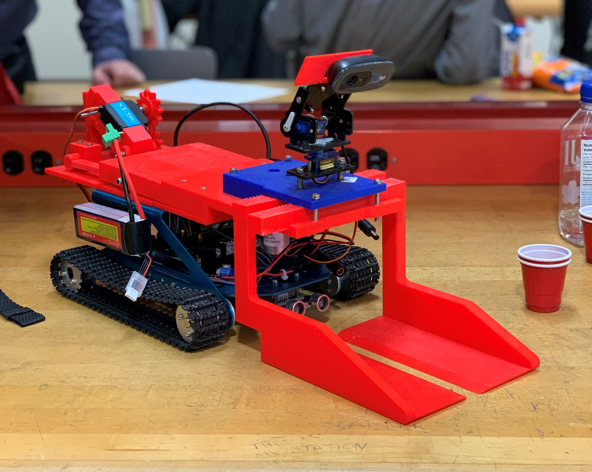
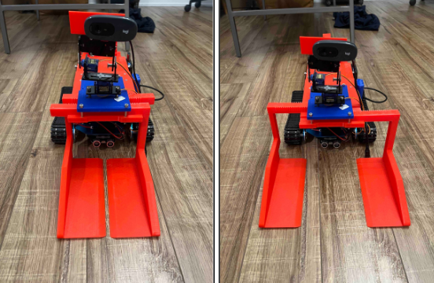
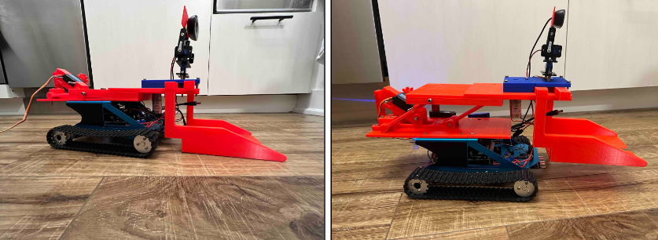
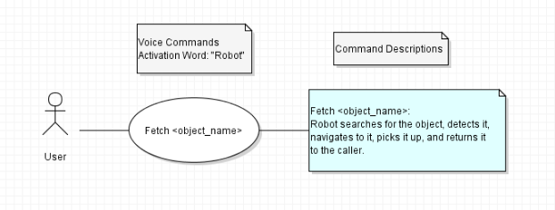
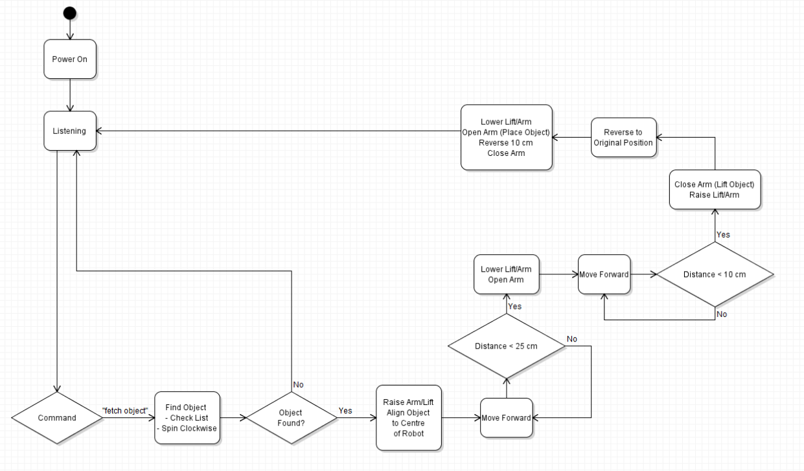

# Capstone Project

## Autonomous Fetching Assistant with Voice Control for Assisted Living

An embedded systems capstone project with the objective of developing an autonomous fetching assistant that can roam a person's house, through the use of voice commands, for assisted living.  

Project consisted of a 4-month long design phase and 4-month long prototyping/implementation phase, with a heavy emphasis on project management. The main design areas were: building the hardware rig, object detection, voice detection, navigation, and electronics integration.

Check out this story on the TMU FEAS website:   
https://www.torontomu.ca/engineering-architectural-science/stories-events/2022/05/engineering-day-sees-Undergraduate-students-present-innovative-and-transformative-capstone-projects/

- Finished Prototype

  
<br>

## Features
<br>

- The lifting-arm uses a DC motor to open and close the arms. This allows for the robot to put its arms around an object, and close them on it, lifting the object up from underneath. Additional electronics, such as an ultrasonic sensor and a webcam, are also used to assist the lifting-arm.

  
<br>

- The robot uses a servo motor for lifting the entire platform up and down. This allows for precise, and ajustable, control of the platform's position. Lifting the platform prevents the arms from getting snagged on surfaces and also reduces the friction significantly.

  
<br>

- The robot's use-case is simple; providing fetching assistance by voice command.

  
<br>

- The robot's logic can be seen by the activity/flow diagram below. 'Listening' is done by using Porcupine by Picovoice for wake-word/hot-word detection. Google's Speech-to-Text API is then used to support voice commands. Once a sucessful fetch command is recognized, and once the object is detected, the navigation incorporates the many electronics in order to complete the navigation and fetching operation.

  
<br>

- Object detection is implemented using a TensorFlowLite model, specifically the mobileNet SSD V2 model for its efficient performance. The image below shows the model detecting 'banana' on a sample image. This accuracy is consistent when applying computer vision to the robot's webcam video stream.

  
<br>


## Acknowledgements & Congratulations
Congratulations to the entire team (Alexis, Alice, Rugshan, Rohan) on being the winners of the 2022 Ryerson Engineering Day (RED) Best Poster Award in Computer Engineering. Thanks for all the hard work and contribution during this project. 
<br></br>

# Starting The Program

## Start-up Commands
1. `cd Capstone`
2. `jack_control start`
3. `python3 src/robot.py`  

#### Current Voice Commands:
The free Picovoice license is limits the number of custom wake-words, so the current wake words are:
- `fetch [OBJECT_NAME]` for fetch
- And various other movement commands found in src/robot.py

Say any of the wake-words above to execute their corresponding functions.

# Outdated Setup:

## Git/GitHub Instructions

- This paragraph will make sense **after you read the GIT_INSTRUCTIONS.md page**:
    - Make sure to do a ```git pull``` on the developer branch any time you want to see the most up-to-date developer branch or when you are about to branch out from the developer branch to add a new function/change. This is important because the remote developer branch might have updated while you were gone, working on another feature, or when you accept your own pull request. Yes, you could do a ```git pull``` for other branches.

- Team, please refer to [**GIT_INSTRUCTIONS.md**](GIT_INSTRUCTIONS.md) for instructions on setting up and using our Git + GitHub repository.


## Config

### 1. Operating System:  
	
Currently using Linux (Ubuntu) for development.

### 2. Packages

Please install the following packages required for Porcupine:

#### SpeechRecognition
1. `pip3 install SpeechRecognition`

#### PyAudio
1. `sudo apt-get install python-pyaudio portaudio19-dev python3-pyaudio`
2. `pip install pyaudio`
3. `sudo apt-get install libasound2:i386`

#### JackControl For Raspberry Pi:
1. `sudo apt-get install jackd2`  
2. `jack_control start` 

#### JackControl For Ubuntu:
1. `sudo apt install multimedia-jack` 
2. `pulseaudio --kill`  
3. `jack_control start`

#### Picovoice (Need v2.1.0 for Wake-Words)
1. `pip3 install picovoice`

#### Porcupine
1. ```pip install pvporcupine```  
2. ```pip install python-decouple```
 
#### Permissions
1. ```sudo usermod -a -G audio $USER```  
2. **Log out and log back in.**  
3. **After every log in, please run: ```jack_control start```**

#### Change User Limits ((src)[https://jackaudio.org/faq/linux_rt_config.html])
1. ```sudo nano /etc/security/limits.d/audio.d```  
2. Add the following two lines and save to the file:
   1. ```@audio   -  rtprio     95```
   2. ```@audio   -  memlock    unlimited```

#### OpenCV
1. ```pip install opencv-python```

#### GPIO Zero
1. ```sudo apt install python3-gpiozero```   

#### RPi.GPIO
1. ```pip install RPi.GPIO```  

### 3. Picovoice Access Keys  

In the src/ directory, create a file called '.env'. Open .env in a text editor and paste the following line(s):

`SECRET_KEY=COPY_PASTE_YOUR_ACCESS_KEY_HERE`  
`INPUT_INDEX=PASTE_INDEX_OF_YOUR_INPUT_DEVICE_HERE`  
`PLATFORM="YOUR PLATFORM"` # Either "Ubuntu" or "Raspberry Pi"  

Where, the access key can be obtained by creating a free account at https://picovoice.ai/console/ and copying it from the 'AccessKey' tab.

Refer to earlier instructions for any environment issues.